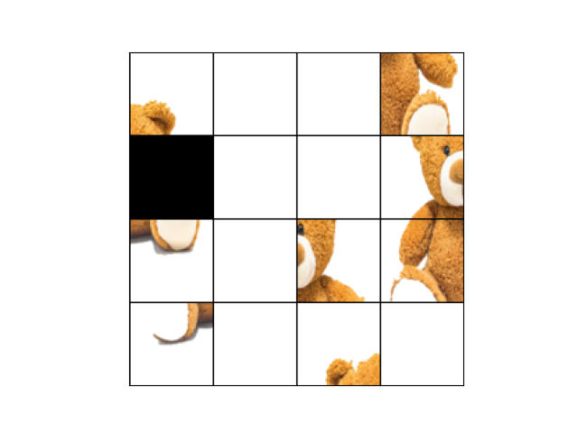
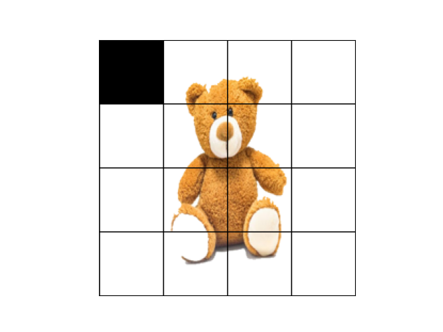
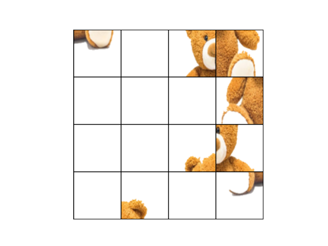
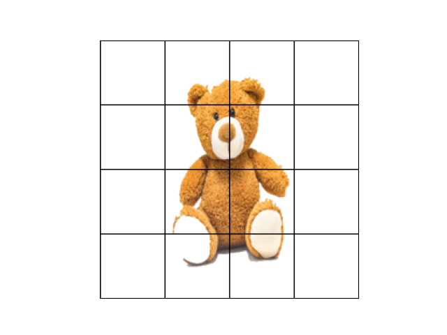
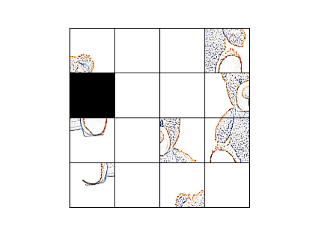
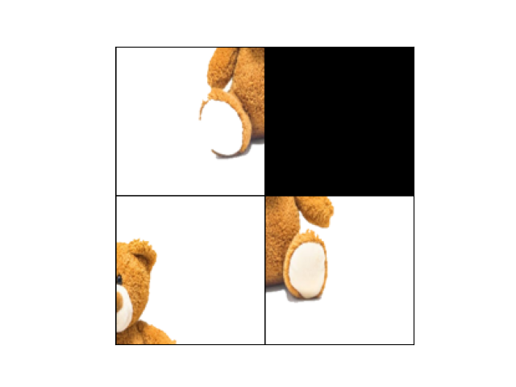
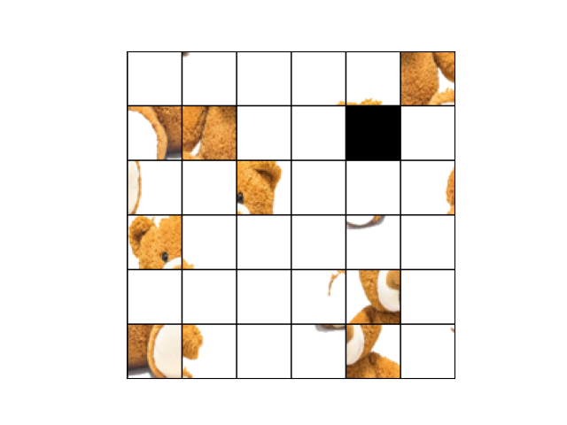
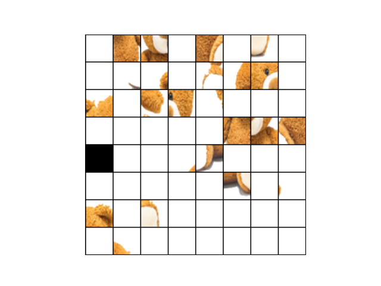
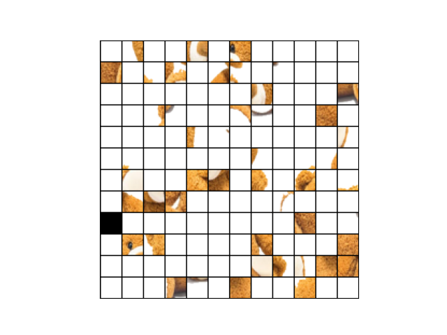
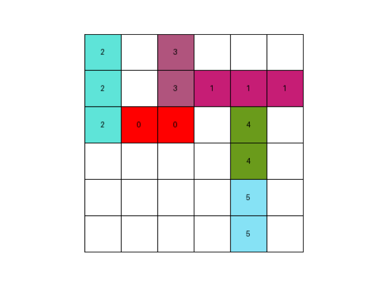

# Simple Puzzle(ing) Benchmark For Visual Reasoning in Vision Language Models

This repository provides some simple tasks based on sliding puzzles like 
- N-Puzzle
- N-Puzzle with modified image (blurring, contours, etc.) 
- N-Tile Jigsaw
- N-Tile Jigsaw with modified image (blurring, contours, etc.) 
- Rush-Hour (uses boards by [rush](https://github.com/fogleman/rush))

These tasks are set up as gymnasium environments as it allows for versatile evaluation (and can also be used to evaluate models other than VLMs).
<!-- 
<details>
  <summary><i>Proj. Phil.</i></summary>
  <p>Thoughts put in words through a smart model - </p>

  <p>In science's march, new methods rise,
Embracing old solutions as they grow.
But AI's path takes a strange guise,
Where novel tools don't always know,
The simple tricks their elders mastered,
Leaving gaps where once was whole.
A curious dance of progress plastered,
With steps both forward and retrograde roll.</p>
</details>
-->

## Installation -

```bash
pip install "visual_puzzle @ git+https://github.com/Sahaj09/Visual-Puzzles.git@main"
```
## Usage

```python
import gymnasium as gym
import visual_puzzle


env = gym.make("n_Puzzle-v0", render_mode="human")
# env = gym.make("jigsaw-v0", render_mode="human")
# env = gym.make("RushHour-v0", render_mode = "human")

observation, info = env.reset(seed=42)

for _ in range(1000):
   action = env.action_space.sample()  # this is where you would insert your policy
   observation, reward, terminated, truncated, info = env.step(action)

   if terminated or truncated:
      observation, info = env.reset()
```

## N-puzzle

The observation is an RGB image. The actions - up, down, left, and right (which moves the blank tile in that direction). The goal of the puzzle is to manipulate the tiles in order to get the goal format.


| Start State | Goal State|
   |-----------------------|-------------|
   |  |  |

## Jigsaw
The observation is an RGB image. The actions - [[a, b], [c, d]] where $a,b,c,d \in [0,N)$ in a $N\times N$ puzzle. [a, b] is the position of the first tile, [c, d] is the position of the second tile, and choosing these tiles leads to a swap between them. 

The goal of the puzzle is to manipulate the tiles in order to get the goal format.


| Start State | Goal State|
   |-----------------------|-------------|
   |  |  |


## Variations of N-Puzzle and Jigsaw
Various transformations can be applied to the images in both the N-puzzle and Jigsaw tasks to make the task perceptually challenging for the agents. (Currently supports "BLUR", "CONTOUR", "EDGE_ENHANCE", "DETAIL, "EDGE_ENHANCE_MORE", "EMBOSS", "FIND_EDGES", "SHARPEN", "SMOOTH", "SMOOTH_MORE" from PIL library)

|Blur Image| Contour Image|
|-----------|-----------|
|| |

In addition, the number of pieces in the puzzle can also be changed to increase or decrease difficulty of the task.

| Puzzle size | Puzzle |
|-------------|-------|
| 4-tiles     |  |
| 36-tiles    |  |
| 64-tiles    |  |
| 144-tiles   |  |

## Rush-Hour
The rush-hour game is sliding puzzle where the goal is to have the red tile (in our case, also indexed as 0) reach the right end of the board. More about this game can be read [here](https://en.wikipedia.org/wiki/Rush_Hour_(puzzle)) and in this amazing [blog](https://www.michaelfogleman.com/rush/).

The observation is an RGB image. The actions - [a, b] where a is the index of the tile, and b is the direction (up, down, left, right). 

|Example State|
|-----------|
|

### Third-Party Content
This project uses rush.txt file from [rush](https://github.com/fogleman/rush) 
under the MIT-License.


### Cite
If you use this project or find it inspirational for your work, please cite it as follows:
```bibtex
@misc{Maini2024,
  author = {Maini, Sahaj Singh},
  title = {{Visual-Puzzles: Simple Puzzle(ing) Benchmark For Visual Reasoning in Vision Language Models}},
  year = {2024},
  url = {https://github.com/Sahaj09/Visual-Puzzles}
}
```